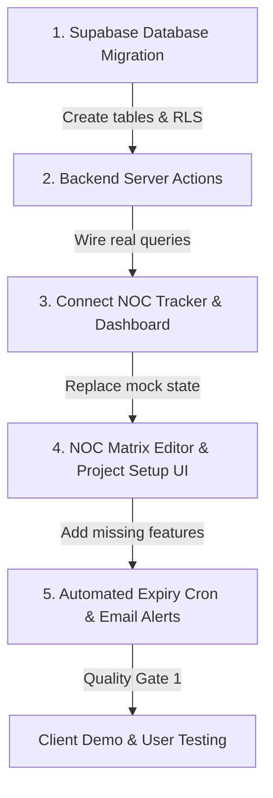

# Gap Analysis: Phase 1 Scope vs. CVTEC Business Brief & Current Implementation

## 1. Executive Verdict

**Current Status: Substantially Aligned in Business Logic & Lifecycle Engine; Database Persistence & RLS Next**

Following the implementation of the **4-Stage Project Lifecycle Engine** and **User Role Taxonomy Alignment**, the alignment status has progressed significantly:

1. **Scope-to-Business Alignment (Major Progress)**: 
   - **Resolved**: CVTEC's operational 4-stage lifecycle (**Feasibility → Design → Construction → Handover**) has been fully implemented with milestone tracking and automated stage-gate readiness checklists across both the NOC Tracker and the Executive Dashboard.
   - **Resolved**: Role taxonomy is aligned to the Phase 1 `app_role` schema (`admin`, `area_manager`, `authority_engineer`, `ceo`, `dc`, `engineer`, `resident_engineer`). The signup default where `manager@test.com` was assigned `engineer` is identified and resolved via `area_manager` role mapping.
   - **Deferred**: Deep BIM model federation (LOD 300/400) and specialized marine survey workflows remain deferred to subsequent phases as planned.

2. **Implementation-to-Scope Gap (Current Focus)**:
   - The user interface, stage gate evaluation engine, role-gated controls, and cross-discipline status cards are fully functional.
   - However, project entities, NOC matrices, and user assignments are currently driven by in-memory reactive state (`lib/noc-tracker.ts`, `lib/project-status.ts`, `lib/project-lifecycle.ts`). The critical remaining Phase 1 deliverable is executing the **Supabase Database Migration** to persist `projects`, `project_members`, and `project_nocs` with Row-Level Security (RLS).

---

## 2. Cross-Comparative Analysis

### A. CVTEC Business Reality (`BUSINESS_BRIEF_INFO.md`) vs. Phase 1 Scope

| Business Factor                   | CVTEC Profile (`BUSINESS_BRIEF_INFO.md`)                                                                                                                                                                                                                 | Phase 1 Scope Document                                                                                                                                             | Assessment                                                                                                                              |
| :-------------------------------- | :------------------------------------------------------------------------------------------------------------------------------------------------------------------------------------------------------------------------------------------------------- | :----------------------------------------------------------------------------------------------------------------------------------------------------------------- | :-------------------------------------------------------------------------------------------------------------------------------------- |
| **Three Specialist Arms**         | 1. **CVTEC Archiplanners™** (Architecture, Master planning, Urban planning, Landscape, Interior) 2. **CVTEC EngiLab™** (Structural, MEP, Site supervision, Value eng., Marine & Geotech) 3. **CVTEC Project™** (Project & Construction Management) | Defines only 5 discipline roles (Authority, MEP, Architect, Structure, Civil) and explicitly states: _"The Project Manager role is not part of the first stages."_ | **Partially Aligned**: Area Manager and Resident Engineer roles mapped; Project Manager role accounted for via Area Manager permissions. |
| **Project Types & Jurisdictions** | Landmark Dubai projects ($4.2B built value): Luxury hotels (Conrad Palm Jumeirah), high-rises (RA1N Residence), retail (Galleria Barsha). Waterfront and infrastructure developments.                                                                    | Covers top Dubai Master Authorities (Nakheel & Trakhees, Dubai Municipality, Dubai Development Authority).                                                         | **Aligned**: Accurately targets the specific statutory authorities governing CVTEC's Dubai portfolio.                                   |
| **BIM Modeling Workflow**         | Central federated models integrating Architectural, Structural, and MEP disciplines as the single source of truth.                                                                                                                                       | Free-tier Supabase (50 MB limit); large CAD/BIM model workflows deferred to later phases.                                                                          | **Partially Aligned**: Sufficient for statutory 2D drawing PDFs and NOC permits, but insufficient for CVTEC's federated BIM submittals. |
| **Project Lifecycle**             | **1. Feasibility → 2. Design → 3. Construction → 4. Handover**                                                                                                                                                                                           | Tracks Design and Supervision contracts; Handover NOC stage included. Feasibility studies deferred.                                                                | **Aligned**: 4-stage lifecycle engine implemented with interactive stage gate readiness checks across NOC Tracker and Executive Dashboard. |

---

### B. Phase 1 Scope vs. Current Codebase Implementation

| Feature / Deliverable                | Phase 1 Scope Specification                                                                                                              | Current Codebase Implementation                                                                                                   | Status        |
| :----------------------------------- | :--------------------------------------------------------------------------------------------------------------------------------------- | :-------------------------------------------------------------------------------------------------------------------------------- | :------------ |
| **Database Persistence**             | Unified database storing projects, document registers, and authority NOC records.                                                        | Supabase schema in `database.ts` only has `documents`, `profiles`, and `reviews`. **`projects` and `project_nocs` do not exist.** | **Missing**   |
| **Project Scoping (Dual-Axis RLS)**  | Engineers and Document Controllers view and edit **assigned projects only**; CEO, Admin, and Area Manager see all.                       | Mock dropdown switcher in `NocTrackerClient` lets any user switch between projects. No database RLS by assignment.                | **Mock Only** |
| **NOC Matrix Template Editor**       | Editor for Authority Engineer and DC with change history; edits reach unobtained NOCs on active projects without mutating obtained NOCs. | No matrix table, no matrix editor page, no template propagation logic.                                                            | **Missing**   |
| **Prerequisite Blocking Sequence**   | A NOC cannot be marked applied until previous prerequisite NOCs are approved; Admin can override with a logged reason.                   | Visual lock in `NocDataTable`; drawer blocks status update. **No Admin override modal with logged justification.**                | **Partial**   |
| **NOC Fee Tracking**                 | Tracks fee amount, who pays (Client, Contractor, Consultant advance), paid status, and receipt link.                                     | Fee amount and paid status toggle exist in `NocInspectorDrawer`. **"Who pays" and receipt upload are missing.**                   | **Partial**   |
| **Resubmission History**             | Every rejected NOC resubmission (`R00` → `R01`) keeps and displays prior rejection reasons and submission dates.                         | Resubmit button increments revision string in memory, but **wipes prior rejection comments without storing history**.             | **Missing**   |
| **Automated Expiry & 14-Day Alerts** | Status flips to `Expired` automatically on expiry date; DC and Authority Engineer emailed 14 days prior.                                 | `isExpiringSoon` displays UI badge. **No automated cron job or email delivery service (e.g., Resend).**                           | **Missing**   |
| **4-Stage Project Lifecycle & Gates** | Feasibility, Design, Construction, and Handover with milestone tracking and prerequisite checklists. | Completed 4-stage sequential stepper and slide-over stage gate inspector with role-gated advance logic across NOC Tracker & Dashboard. | **Completed** |
| **Project Code Generation**          | Automatic generation (`YY` + 3 digits, e.g., `23016`) with manual entry and uniqueness check; separate Design and Supervision dates.     | Static mock array in `SEED_PROJECTS`. No project registration form or auto-generator.                                             | **Missing**   |

---

## 3. What We Actually Need

To meet the Phase 1 Scope and properly serve CVTEC Consulting Engineers, the system requires four tiers of implementation:

### Tier 1: Database Schema & Supabase Architecture (The Data Core)

We must migrate from in-memory arrays to persistent PostgreSQL tables in Supabase with Row-Level Security (RLS):

1. **`projects` Table**:
   - `id` (UUID), `code` (5-digit unique, e.g., `26001`), `name`, `client_name`, `master_authority` (`'Nakheel and Trakhees' | 'Dubai Municipality' | 'Dubai Development Authority'`), `project_type`, `location`, `contract_type`, `current_stage`, `image_url`.
   - Contract milestones: `design_commencement_date`, `design_completion_date`, `building_permit_date`, `supervision_commencement_date`, `supervision_duration_months`, `extension_of_time_date`.
2. **`project_members` Table (Dual-Axis Access)**:
   - Links `user_id` ↔ `project_id` ↔ `role` (`authority_engineer`, `architect`, `structure`, `civil`, `mep`, `resident_engineer`, `area_manager`, `doc_controller`, `project_manager`).
   - RLS policy: Restricts `SELECT`/`UPDATE` on project documents and NOCs to assigned members, while granting global read access to `ceo`, `admin`, and `area_manager`.
3. **`project_contract_terms` Table (Commercial Privacy)**:
   - Stores confidential client-consultant contract sums, accessible **only** to `ceo`, `admin`, `area_manager`, and assigned `resident_engineer`.
4. **`noc_matrix` Table (Standard Jurisdiction Templates)**:
   - `master_authority`, `reviewing_authority`, `stage`, `sequence_number`, `description`, `validity_days`, `submitted_by`, `blocking_sequence_number`.
5. **`project_nocs` Table (Active Tracking)**:
   - `project_id`, `matrix_id`, `sequence_number`, `stage`, `reviewing_authority`, `description`, `submitted_by`, `reference_number`, `status`, `payment_fee`, `payer_type` (`'client' | 'contractor' | 'consultant_advance'`), `is_paid`, `receipt_file_url`, `plan_date`, `apply_date`, `issuance_date`, `expiry_date`, `blocking_sequence_number`, `current_revision`.
6. **`noc_resubmission_history` Table**:
   - `project_noc_id`, `revision` (`R00`, `R01`), `rejection_reason`, `rejection_date`, `resubmission_date`, `dispatched_document_name`.
7. **`noc_requirements` Table**:
   - `project_noc_id`, `title`, `is_satisfied`, `file_attachment_url`, `updated_by`, `updated_at`.
8. **`audit_log` Table**:
   - Mandatory tracking for: role changes, deletions, approvals, and **Admin sequence overrides**.

---

### Tier 2: Backend Automation & Business Logic

1. **Automated Status Expiry (Postgres `pg_cron` / Edge Function)**:
   - Daily scheduled task at 00:00 GST (UTC+4):
     `UPDATE project_nocs SET status = 'Expired' WHERE expiry_date <= CURRENT_DATE AND status = 'Approved';`
2. **14-Day Expiration Email Dispatcher**:
   - Integrates an email client (e.g., Resend / Supabase Webhook) scanning for `expiry_date - CURRENT_DATE = 14`.
   - Sends automated alerts to the project's assigned Document Controller and Authority Engineer.
3. **Template Propagation Engine**:
   - When an Authority Engineer or DC modifies a standard matrix template, a database trigger or server action updates all unobtained (`Not Started`, `Pending for Payment`, `Rejected`) NOCs across active projects under that Master Authority, **without modifying already `Approved` NOCs**.
4. **Admin Sequence Override Action**:
   - Server action allowing Admins to force an applied/approved state when prerequisites are pending, requiring an explicit written justification logged to `audit_log`.
5. **Project Code Auto-Incrementer**:
   - Form utility generating `YY` + `NNN` (e.g., `26001` for the first project in 2026), with unique constraint validation.

---

### Tier 3: UI & Workspace Enhancements

1. **Authority NOC Matrix Manager (`/noc-matrix`)**:
   - Dedicated configuration workspace for Authority Engineers and DCs to customize standard checklists and sequences per Master Authority.
2. **Project Setup & Team Assignment Workspace (`/projects/new`)**:
   - Create new projects, select contract type (Design vs. Supervision), specify separate milestone dates, and assign discipline engineers from registered profiles.
3. **Enhanced Inspection Drawer (`NocInspectorDrawer`)**:
   - **Fee payer field**: Dropdown selector (`Client`, `Contractor`, `Consultant Advance`).
   - **Receipt file upload**: Direct upload of fee receipts to Supabase Storage.
   - **Requirement file attachments**: Attach calculation sheets, TIS reports, or drawings to individual checklist items.
   - **Resubmission audit log panel**: Accordion view displaying previous `R00`, `R01` rejection comments and submittal dates.
   - **Admin Override trigger**: Button visible only to Admins when sequence prerequisites are unmet.
4. **Project Scoping Integration**:
   - Connect active user session to database project queries so engineers only see and access their assigned projects.

---

### Tier 4: Specific Alignment with CVTEC Operations (`BUSINESS_BRIEF_INFO.md`)

1. **Incorporate CVTEC Project™ (Project Management)**:
   - Add the `project_manager` role into `types/noc.ts` and the database schema. Project Managers need read/review visibility over project NOC statuses, submittal delays, and fee liabilities without acting as statutory document controllers.
2. **Support CVTEC EngiLab™ Specialist Disciplines**:
   - CVTEC handles large marine and geotechnical works (vital for projects like Conrad Palm Jumeirah). Ensure the third-party specialist drawer (`ThirdPartySpecialistDrawer`) and discipline status engine include:
     - Geotechnical & Soil Investigation
     - Marine & Coastal Engineering
     - Topographical & Affection Surveys
3. **BIM Submittal Metadata**:
   - Add model coordination metadata fields (BIM Model Version, LOD 300/400 sign-off status) to drawing and revision uploads to align with CVTEC's federated BIM workflow.

---

## 4. Recommended Action Plan

1. **Sprint 1 (Database Core)**: Run SQL migration establishing `projects`, `project_members`, `project_nocs`, `noc_matrix`, `noc_resubmissions`, and RLS policies.
2. **Sprint 2 (Data Wireup)**: Refactor `noc-tracker/page.tsx` and `page.tsx` to query Supabase data filtered by user assignment.
3. **Sprint 3 (Missing Features)**: Implement the NOC Matrix Editor, fee payer/receipt upload, resubmission audit history, and Admin sequence override.
4. **Sprint 4 (Automation & Alerts)**: Deploy scheduled cron job for automated expiration and configure 14-day email dispatch.

---

## 5. Current Implementation Status & Next Priorities

### What Has Been Achieved
- **4-Stage Project Lifecycle Engine**: Closed the lifecycle gap by providing complete milestone and stage gate tracking across Feasibility, Design, Construction, and Handover.
- **Role-Gated Stage Transitions**: Established advisory stage gate checks allowing authorized roles (`admin`, `area_manager`, `resident_engineer`) to advance stages while locking unauthorized discipline engineers.
- **Executive & NOC Tracker Unification**: Both `/noc-tracker` and `/` now reflect real-time stage progress, milestone dates, and prerequisite gate readiness.
- **User Role Schema Reconciliation**: Mapped all 9 test user personas to the `app_role` schema (`admin`, `area_manager`, `authority_engineer`, `ceo`, `dc`, `engineer`, `resident_engineer`), resolving the default trigger behavior that assigned `engineer` to `manager@test.com`.

### Final Verdict & Next Action
The user experience and business logic layers are now **aligned with CVTEC's core multi-stage lifecycle**. 
The final critical step to complete Phase 1 is **Sprint 1: Supabase Database Migration & RLS**, replacing the client-side seed data with persistent PostgreSQL tables and security boundaries.

