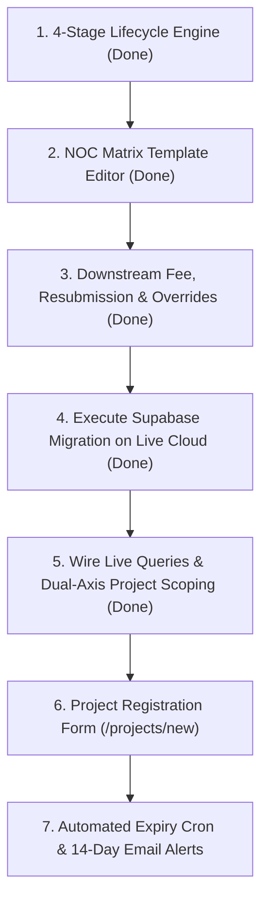

# Gap Analysis: Phase 1 Scope vs. CVTEC Business Brief & Current Implementation

## 1. Executive Verdict

**Current Status: Core Business Logic, Lifecycle Engine, NOC Matrix Template Subsystem & Downstream Audit Controls Completed; Live Supabase Execution & Email Alerts Next**

Following the successful implementation of the **Authority NOC Matrix Template Editor**, **Template Propagation Engine**, and **Downstream Phase 1 Inspector Enhancements**, the project has achieved major milestones:

1. **Scope-to-Business Alignment (Major Progress)**:
   - **Resolved**: CVTEC's operational 4-stage lifecycle (**Feasibility → Design → Construction → Handover**) is fully implemented with milestone tracking and automated stage-gate readiness checklists across both the NOC Tracker and Executive Dashboard.
   - **Resolved**: **NOC Matrix Template Subsystem (`/noc-matrix`)** is fully operational across Dubai's 3 Master Authorities (_Nakheel & Trakhees_, _Dubai Municipality_, _Dubai Development Authority_). It strictly enforces the **Golden Propagation Rule**: updates cascade to unobtained NOCs (`Not Started`, `Pending for Payment`, `Rejected`) on active projects while **never altering approved NOCs**.
   - **Resolved**: **Downstream Phase 1 Features**: Fee payer classification (`Client`, `Contractor`, `Consultant Advance`) and receipt links, resubmission audit history (`R00` → `R01`), and role-gated **Admin Sequence Prerequisite Overrides** with mandatory justification logging are fully integrated into [`NocInspectorDrawer`](file:///D:/giomj/Projects/engineer-docs-collab/components/noc/noc-inspector-drawer.tsx).
   - **Resolved**: Role taxonomy is aligned to the Phase 1 `app_role` schema (`admin`, `area_manager`, `authority_engineer`, `ceo`, `dc`, `engineer`, `resident_engineer`).
   - **Deferred**: Deep BIM model federation (LOD 300/400) and specialized marine survey submittals remain deferred to subsequent phases as planned.

2. **Implementation-to-Scope Gap (Current Focus)**:
   - Complete SQL migration script ([`supabase/migrations/20261001000000_noc_matrix_and_downstream.sql`](file:///D:/giomj/Projects/engineer-docs-collab/supabase/migrations/20261001000000_noc_matrix_and_downstream.sql)) and TypeScript database types are in place. The next critical step is executing this migration against the live Supabase cloud database instance and wiring live database queries to replace client-side mock fallback state.
   - Automated 14-day expiry cron dispatcher and email notifications (e.g., via Resend).
   - Project registration form and auto-code generator (`/projects/new`).

---

## 2. Cross-Comparative Analysis

### A. CVTEC Business Reality (`BUSINESS_BRIEF_INFO.md`) vs. Phase 1 Scope

| Business Factor                   | CVTEC Profile (`BUSINESS_BRIEF_INFO.md`)                                                                                                                                                                                                                 | Phase 1 Scope Document                                                                                                                                             | Assessment                                                                                                                                 |
| :-------------------------------- | :------------------------------------------------------------------------------------------------------------------------------------------------------------------------------------------------------------------------------------------------------- | :----------------------------------------------------------------------------------------------------------------------------------------------------------------- | :----------------------------------------------------------------------------------------------------------------------------------------- |
| **Three Specialist Arms**         | 1. **CVTEC Archiplanners™** (Architecture, Master planning, Urban planning, Landscape, Interior) 2. **CVTEC EngiLab™** (Structural, MEP, Site supervision, Value eng., Marine & Geotech) 3. **CVTEC Project™** (Project & Construction Management) | Defines only 5 discipline roles (Authority, MEP, Architect, Structure, Civil) and explicitly states: _"The Project Manager role is not part of the first stages."_ | **Partially Aligned**: Area Manager and Resident Engineer roles mapped; Project Manager role accounted for via Area Manager permissions.   |
| **Project Types & Jurisdictions** | Landmark Dubai projects ($4.2B built value): Luxury hotels (Conrad Palm Jumeirah), high-rises (RA1N Residence), retail (Galleria Barsha). Waterfront and infrastructure developments.                                                                    | Covers top Dubai Master Authorities (Nakheel & Trakhees, Dubai Municipality, Dubai Development Authority).                                                         | **Aligned**: Accurately targets the specific statutory authorities governing CVTEC's Dubai portfolio.                                      |
| **BIM Modeling Workflow**         | Central federated models integrating Architectural, Structural, and MEP disciplines as the single source of truth.                                                                                                                                       | Free-tier Supabase (50 MB limit); large CAD/BIM model workflows deferred to later phases.                                                                          | **Partially Aligned**: Sufficient for statutory 2D drawing PDFs and NOC permits, but insufficient for CVTEC's federated BIM submittals.    |
| **Project Lifecycle**             | **1. Feasibility → 2. Design → 3. Construction → 4. Handover**                                                                                                                                                                                           | Tracks Design and Supervision contracts; Handover NOC stage included. Feasibility studies deferred.                                                                | **Aligned**: 4-stage lifecycle engine implemented with interactive stage gate readiness checks across NOC Tracker and Executive Dashboard. |

---

### B. Phase 1 Scope vs. Current Codebase Implementation

| Feature / Deliverable                 | Phase 1 Scope Specification                                                                                                              | Current Codebase Implementation                                                                                                                                                                                                    | Status               |
| :------------------------------------ | :--------------------------------------------------------------------------------------------------------------------------------------- | :--------------------------------------------------------------------------------------------------------------------------------------------------------------------------------------------------------------------------------- | :------------------- |
| **NOC Matrix Template Editor**        | Editor for Authority Engineer and DC with change history; edits reach unobtained NOCs on active projects without mutating obtained NOCs. | Dedicated `/noc-matrix` workspace with stage grouping, `MatrixItemEditorDrawer`, dynamic checklist builder, `MatrixRevisionDrawer` audit timeline, and atomic RPC propagation (`propagate_matrix_item_change`).                    | **Completed**        |
| **Prerequisite Blocking Sequence**    | A NOC cannot be marked applied until previous prerequisite NOCs are approved; Admin can override with a logged reason.                   | Visual lock badges in `NocDataTable`; `NocInspectorDrawer` enforces prerequisite gates and provides role-gated **Admin Override Sequence Modal** with mandatory logged justification (>= 15 chars).                                | **Completed**        |
| **NOC Fee Tracking**                  | Tracks fee amount, who pays (Client, Contractor, Consultant advance), paid status, and receipt link.                                     | Integrated in `NocInspectorDrawer`: fee amount editor, paid toggle, payer classification dropdown, receipt reference link, and server action `recordNocFeePayment`.                                                                | **Completed**        |
| **Resubmission History**              | Every rejected NOC resubmission (`R00` → `R01`) keeps and displays prior rejection reasons and submission dates.                         | Resubmission workflow retains prior rejection comments and timestamps, advances revision tag, logs to `noc_resubmission_history`, and displays historical accordion in inspector drawer.                                           | **Completed**        |
| **4-Stage Project Lifecycle & Gates** | Feasibility, Design, Construction, and Handover with milestone tracking and prerequisite checklists.                                     | Completed 4-stage sequential stepper and slide-over stage gate inspector with role-gated advance logic across NOC Tracker & Dashboard.                                                                                             | **Completed**        |
| **Database Persistence**              | Unified database storing projects, document registers, and authority NOC records.                                                        | Migration `20261001000000_noc_matrix_and_downstream.sql` executed against live Supabase instance. All tables, columns, enums, and RLS policies verified active via `db.md`. Next step is wiring server pages to query live tables. | **Live in Database** |
| **Project Scoping (Dual-Axis RLS)**   | Engineers and Document Controllers view and edit **assigned projects only**; CEO, Admin, and Area Manager see all.                       | Integrated live in `lib/server/noc-data.ts` querying `projects` and `project_nocs` governed by Supabase RLS (`private.can_see_project`). Wired to both NOC Tracker and Dashboard.                                                  | **Completed**        |
| **Automated Expiry & 14-Day Alerts**  | Status flips to `Expired` automatically on expiry date; DC and Authority Engineer emailed 14 days prior.                                 | `isExpiringSoon` displays UI badge and KPI table. **Automated scheduled cron and email dispatcher (Resend) pending.**                                                                                                              | **Pending**          |
| **Project Code Generation**           | Automatic generation (`YY` + 3 digits, e.g., `23016`) with manual entry and uniqueness check; separate Design and Supervision dates.     | Static mock array in `SEED_PROJECTS` and database counter table `project_code_counters`. **Registration form pending (`/projects/new`).**                                                                                          | **Pending**          |

---

## 3. Four-Tier Scope Status Breakdown

### Tier 1: Database Schema & Supabase Architecture (The Data Core)

- [x] **`noc_matrix_items` Table**: Schema defined with sequence numbers, blocking sequences, validity days, default fees, and RLS policies.
- [x] **`noc_matrix_requirements` Table**: Standard checklist deliverables per template item.
- [x] **`noc_matrix_revisions` Table**: Immutable audit log capturing author, timestamp, change justification, and propagation metrics.
- [x] **`project_nocs` Table Augmentation**: Enhanced with `payment_fee`, `is_paid`, `payer_type`, `receipt_file_url`, `blocking_sequence_no`, `current_revision`, `override_reason`, `overridden_by`, `overridden_at`.
- [x] **`noc_resubmission_history` Table**: Stores rejection reasons, rejection dates, and resubmission timestamps.
- [x] **`project_noc_requirements` Table**: Checklist items with satisfaction toggles and file attachment links.
- [x] **Live Supabase Execution**: Run `20261001000000_noc_matrix_and_downstream.sql` on live Supabase instance and verify RLS enforcement (Verified live via Supabase schema export in `db.md`).

---

### Tier 2: Backend Automation & Business Logic

- [x] **Atomic Template Propagation Engine**: Stored procedure `propagate_matrix_item_change` updates template items and selectively cascades modifications to active projects' unobtained NOCs while preserving `Approved` NOCs.
- [x] **Admin Sequence Override Action**: Role-gated server action `adminOverridePrerequisiteSequence` requiring mandatory justification logged to audit trail.
- [x] **Fee Payment & Resubmission Server Actions**: `recordNocFeePayment` and `resubmitNocRevision` in [`app/(app)/noc-tracker/actions.ts`](<file:///D:/giomj/Projects/engineer-docs-collab/app/(app)/noc-tracker/actions.ts>).
- [ ] **Automated Status Expiry (`pg_cron` / Edge Function)**: Daily scheduled job at 00:00 GST setting status to `Expired` when `expiry_date <= CURRENT_DATE`.
- [ ] **14-Day Expiration Email Dispatcher**: Automated email delivery (e.g., via Resend) notifying assigned DC and Authority Engineer 14 days before expiry.
- [ ] **Project Code Auto-Incrementer**: Form utility generating `YY` + `NNN` (e.g., `26001`) with unique constraint validation.

---

### Tier 3: UI & Workspace Enhancements

- [x] **Authority NOC Matrix Manager (`/noc-matrix`)**: Dedicated configuration workspace with authority tab switcher, stage grouping, sequence display, and add/edit triggers.
- [x] **Matrix Item Editor Drawer (`MatrixItemEditorDrawer`)**: 480px slide-over drawer with dynamic checklist builder, acyclic prerequisite picker, fee/validity counters, and mandatory change justification.
- [x] **Matrix Revision Drawer (`MatrixRevisionDrawer`)**: Chronological audit timeline displaying author credentials, timestamp, justification card, and propagation impact metrics.
- [x] **Enhanced Inspection Drawer (`NocInspectorDrawer`)**:
  - Fee payer classification selector (`Client`, `Contractor`, `Consultant Advance`) and receipt link.
  - Resubmission audit history accordion displaying prior rejection comments and timestamps.
  - Admin sequence override dialog with mandatory reason text box.
- [ ] **Project Setup & Team Assignment Workspace (`/projects/new`)**: Create new projects, select contract type, configure milestones, and assign team members.
- [x] **Project Scoping Live Wireup**: Replace client-side project switcher with session-filtered Supabase queries so engineers only see their assigned projects (Completed via `lib/server/noc-data.ts`).

---

### Tier 4: Specific Alignment with CVTEC Operations (`BUSINESS_BRIEF_INFO.md`)

- [x] **Support CVTEC Specialist Disciplines**: Third-party specialist drawer (`ThirdPartySpecialistDrawer`) and discipline status engine include Geotechnical, Marine, Topographical, Traffic Impact Studies, and Green Building.
- [x] **Statutory Jurisdiction Alignment**: Specific coverage of Nakheel/Trakhees, Dubai Municipality, and Dubai Development Authority.
- [ ] **Incorporate CVTEC Project™ (Project Management)**: Add explicit `project_manager` role permissions across project status views.
- [ ] **BIM Coordination Metadata**: Add BIM Model Version and LOD 300/400 sign-off status to drawing revision uploads.

---

## 4. Current Status & Next Action Roadmap

### Next Implementation Priorities

1. **Sprint 1 (Cloud Database Wireup) - [COMPLETED]**:
   - [x] Apply `supabase/migrations/20261001000000_noc_matrix_and_downstream.sql` to active Supabase project (Verified live in `db.md`).
   - [x] Refactor `app/(app)/noc-tracker/page.tsx` and `app/(app)/page.tsx` via `lib/server/noc-data.ts` to read directly from Supabase tables filtered by user project assignments.
2. **Sprint 2 (Project Setup Workspace)**:
   - Build `/projects/new` allowing Admins and Area Managers to register new projects, select Master Authority templates, generate unique project codes, and assign discipline teams.
3. **Sprint 3 (Automated Alerts & Expiration)**:
   - Configure Supabase Edge Function or scheduled cron job for automated expiration and 14-day alert email delivery.
